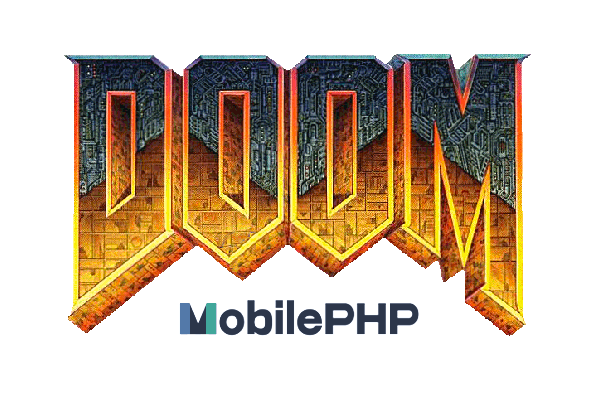

<p align="center"></p>

## About DOOM mobile PHP

DOOM mobile PHP is a DOS game built on top of Tauri and heavily influenced by NativePHP. This mobile application uses Laravel InertiaJS Vue3 Typescript Tailwindcss and Tauri, only.

It uses JS-DOS to emulate the DOS engine. And DOOM is hosted on a CDN.

I always wanted to play DOS games on my mobile phone without the use of Steam or online platforms.
It was possible before, but now it is easy, it took me a lot more days.

<br>

## Installation

1. Clone the repository on your local environment and go through directory

```bash
git clone https://github.com/mho22/doom-mobile-php.git

cd doom-mobile-php
```

<br>

2. Install dependencies

```bash
composer install

npm install
```

<br>

3. Copy .env.example and generate key

```bash
cp .env.example .env

php artisan key:generate
```

<br>

4. Adapt your HMR host in vite configuration file

```bash
hmr : {
    ...
    host : "192.168.0.*",
    ...
},
```

<br>

5. Serve on mobile

```bash
php artisan mobile:serve --android
```

<br>

6. Kill some Cacodemon

<br>

## Suggestions

Don’t hesitate to give me some feed backs and suggestions to improve the project on this github repository or on twitter : [Capsules Codes](https://twitter.com/capsulescodes)

<br>

Based on [NativePHP](https://nativephp.com/) and [Doom native PHP](https://github.com/mho22/doom-native-php). Special thanks to [Simon Hamp](https://github.com/simonhamp).
